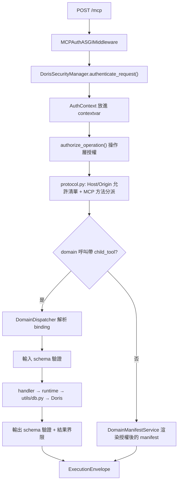

<!--
Licensed to the Apache Software Foundation (ASF) under one
or more contributor license agreements.  See the NOTICE file
distributed with this work for additional information
regarding copyright ownership.  The ASF licenses this file
to you under the Apache License, Version 2.0 (the
"License"); you may not use this file except in compliance
with the License.  You may obtain a copy of the License at

  http://www.apache.org/licenses/LICENSE-2.0

Unless required by applicable law or agreed to in writing,
software distributed under the License is distributed on an
"AS IS" BASIS, WITHOUT WARRANTIES OR CONDITIONS OF ANY
KIND, either express or implied.  See the License for the
specific language governing permissions and limitations
under the License.
-->

# 設計與擴充指南

這份文件是給「要動這個 codebase 的人」看的:先講清楚系統怎麼組起來、一個請求
會經過哪些關卡,然後給出常見擴充的具體改動步驟(改哪個檔案、改什麼、會被哪個
測試擋下來)。

概念層面的架構說明在
[Architecture overview](architecture/overview.md) 和
[Request and data flow](architecture/request-lifecycle.md);這份文件不重複它們,
而是補上「檔案層級」的地圖。工具的權威清單是產生出來的
[tool registry](tool-registry.md),不要手改。

## 1. 這個系統在做什麼

一句話:**把 MCP 協定翻譯成經過認證、能力感知、有上限的 Doris 唯讀操作**。

它不取代 Doris 的 SQL 引擎、catalog、RBAC 或儲存層。它提供的是四件事:

1. **穩定的工具契約** — Host 只註冊 8 個 domain 工具,55 個 child 用漸進揭露
   (progressive disclosure)在被選到 domain 時才展開 schema。
2. **可判定的授權** — 認證產生 request-scoped 身分,操作策略用精確識別字授權,
   Doris RBAC 是最終權威。
3. **能力感知** — 可用性來自對「當前連線路由」的實際探測,不是版本號猜測。
   不支援的能力仍然看得到,但 `callable=false`,呼叫時 fail closed。
4. **有界執行** — SQL 形狀、識別字、參數、逾時、列數、位元組數、輸出 schema
   都在資料離開 Server 前被限制住。

## 2. 目錄地圖

先記住這張表,後面的擴充配方都在這些檔案之間移動。

| 路徑 | 職責 |
|---|---|
| `doris_mcp_server/main.py` | CLI 進入點、`DorisServer`、stdio/HTTP 啟動、路由組裝 |
| `doris_mcp_server/multiworker_app.py` | 多 worker 模式的 ASGI app 與輔助路由表 |
| `doris_mcp_server/protocol.py` | MCP 協定核心、transport 安全(Host/Origin 允許清單) |
| `doris_mcp_server/http_transport.py` | Streamable HTTP 傳輸 |
| `doris_mcp_server/schema_validation.py` | 輸入/輸出 JSON Schema 編譯與驗證 |
| `doris_mcp_server/health.py` | `/live`、`/ready`、`/health` |
| **工具控制面** | |
| `tools/domain_models.py` | 契約型別(`ChildToolDefinition`、`DomainDefinition`、`Availability`…) |
| `tools/domain_catalog.py` | **公開目錄的唯一真實來源**:8 domain / 55 child 的定義 |
| `tools/doris_feature_matrix.py` | 每個 child 的版本/執行期支援契約與探針需求 |
| `tools/domain_manifest.py` | 依授權與可用性渲染 manifest |
| `tools/domain_dispatcher.py` | 把 domain/child 呼叫綁定到真正的 handler、驗證輸入輸出 |
| `tools/capability_detector.py` | 對 Doris 跑探針(probe),產生能力快照 |
| `tools/capability_registry.py` | 快照快取、TTL、陳舊回退 |
| `tools/tool_registry.py` | 工具的策略/稽核 metadata、`policy_definition_for_tool` |
| `tools/tools_manager.py` | `DorisToolsManager`:把所有 handler mixin 組起來 |
| `tools/*_handlers.py` | 各 domain 的 formal handler(薄轉接層) |
| `tools/tool_provider.py` | 外掛式 custom tool provider(entry point) |
| **執行面** | |
| `utils/*_runtime.py` | 真正做事的 runtime(query/cluster/pipeline/search/governance/lakehouse) |
| `utils/db.py` | 連線管理、多 FE failover、路由 |
| `utils/query_executor.py` | 查詢執行與結果界限 |
| **安全** | |
| `utils/security.py` | `DorisSecurityManager`、`AuthContext`、`AuthenticationProvider`、SQL 守衛 |
| `auth/` | 各認證方式的實作(token / JWT / external OAuth / Doris OAuth) |
| `auth/operation_policy.py` | 操作層授權(scope 檢查) |
| **設定** | |
| `utils/config.py` | 所有設定、環境變數解析、驗證、`EffectiveAuthConfig` 正規化 |

## 3. 啟動流程

```
CLI / doris-mcp-server
  └─ main.py: create_arg_parser() → DorisConfig.from_env() → CLI 覆寫
       └─ normalize_effective_auth_config(config)      # 決定 auth_methods、擋掉危險組合
            └─ config.validate()                       # 回傳錯誤清單,不是丟例外
                 └─ ConfigManager.setup_logging()
                      └─ DorisServer(...)
                           ├─ start_stdio()
                           └─ start_http()
                                ├─ 建立 Starlette routes(health / auth / token / oauth)
                                ├─ MCPAuthASGIMiddleware 包住 /mcp
                                └─ workers > 1 → multiworker_app
```

兩個容易忽略的點:

- `normalize_effective_auth_config()` 是**啟動就擋**的關卡。綁在非回環位址而沒有
  任何認證方式時,它直接拋 `AuthConfigError` 拒絕啟動
  (`utils/config.py` 的 `validate_http_bind_auth_policy`)。
- 輔助路由(`/health`、`/live`、`/ready`、`/token/*`、`/oauth/*`)**不經過** MCP
  認證中介層;只有 `/mcp` 和 `/mcp/legacy` 會(`main.py` 的 `mcp_app`)。

## 4. 一次 HTTP 請求的生命週期



關鍵不變式:**discovery 和 execution 各自獨立檢查授權**。manifest 過濾掉的東西,
dispatcher 不會因為 Host 記得舊 manifest 就放行;manifest 版本對不上會回
`CHILD_MANIFEST_STALE` 要求重新探索。

## 5. 四個核心子系統

### 5.1 認證:方法清單 → AuthContext

四種方式,由設定開關決定啟用哪些,順序固定在 `utils/config.py`:

```python
methods: list[str] = []
if enable_doris_oauth_auth: methods.append("doris_oauth")
if enable_token_auth:       methods.append("token")
if enable_jwt_auth:         methods.append("jwt")
if enable_external_oauth_auth: methods.append("external_oauth")
```

執行期在 `utils/security.py` 的 `DorisSecurityManager.authenticate_request()`
依序嘗試,**任一成功即通過**;全部失敗才拋錯。空清單代表匿名(`SecurityLevel.PUBLIC`)。

| 方式 | 開關 | 實作 | 憑證形狀 |
|---|---|---|---|
| 靜態 token | `ENABLE_TOKEN_AUTH` | `auth/token_manager.py` | `TOKEN_<ID>` 環境變數或 `tokens.json` |
| JWT | `ENABLE_JWT_AUTH` | `auth/jwt_manager.py` | 簽章 JWT |
| 外部 OAuth/OIDC | `ENABLE_OAUTH_AUTH` | `auth/oauth_provider.py`、`oauth_client.py` | 外部 IdP 發的 access token |
| Doris OAuth | `ENABLE_DORIS_OAUTH_AUTH` | `auth/doris_oauth_provider.py` | Server 自己發的 `doa_` token,綁 Doris 帳號 |

不管哪一種,產物都是同一個 `AuthContext`(`utils/security.py`),下游只認它:

```python
token_id, user_id, roles, permissions, security_level
client_ip, session_id, auth_method
doris_user            # Doris OAuth 用來決定實際連線身分
oauth_scopes          # 給 operation_policy 檢查
token                 # 原始 token,token-bound 連線池用
pool_key              # Doris OAuth 的一致性檢查(不是路由選擇器)
```

**連線池路由**由 `utils/db.py` 的 `get_connection()` 依這個優先序決定,
新增認證方式時務必想清楚落在哪一層:

1. `auth_method == "doris_oauth"` → 用 `doris_user` 的專屬池。此時
   `pool_key` 若有值且與 `doris_user` 推出的 route key 不符,直接
   `DorisUserPoolMissingError` **fail closed**。
2. `auth_context.token` 非空 → token-bound 池,**不會回退**到全域池。
3. 兩者皆否 → 全域池。

也就是說,新的認證方式如果沒設 `token` 也不是 doris_oauth,所有身分會**共用同一個
全域連線池**,以 Doris 端的單一帳號執行。這通常不是你要的。

### 5.2 授權:操作識別字與 scope

`auth/operation_policy.py` 的 `authorize_operation(auth_context, operation)`:

- `auth_method == "external_oauth"` → 由操作推出必要 scope 並檢查。
  工具呼叫的操作字串是 `tool:<name>`,scope 是 `tool:call:<name>`(domain 類工具
  用 `tool:list`)。
- `auth_method == "doris_oauth"` → 查 `resolve_operation_policy()`,策略必須是
  `allow` 且 scope 相符;預設對 DB 類工具是 **fail closed**。
- 靜態 token、JWT、匿名 → 不套用 OAuth scope 策略,維持既有行為。

工具的策略 metadata 來自 `tools/tool_registry.py` 的 `policy_definition_for_tool()`。
`filter_tools_for_auth_context()` 會在列表階段就先濾一輪:

- `external_oauth` → 沒有策略定義的工具**直接消失**。
- `doris_oauth` → 對每個工具實跑一次 `authorize_operation()`,不過的濾掉。
- 其它(靜態 token、JWT、匿名)→ 不過濾。

所以「同一台 Server,OAuth 使用者看到的工具比 token 使用者少」是設計行為,
不是 bug。新增工具若要給 OAuth 身分用,策略定義是必要條件。

### 5.3 工具契約:catalog → feature matrix → dispatcher → handler

一個 child 工具由四個地方共同定義,缺一不可:

```
domain_catalog.py     name / title / description / input_schema / output_schema
        │                └─ handler_name 自動組成 "child:<domain>:<child>"
        │                └─ authorization_policy = "child:call:<domain>:<child>"
        ▼
doris_feature_matrix.py   支援契約:版本範圍、需要哪些 probe、降級行為
        ▼
domain_dispatcher.py      用命名慣例把 feature 綁到 handler:
                          _formal_<domain>_<child>_tool
        ▼
tools/<domain>_handlers.py   實際 handler(薄的),呼叫 utils/<x>_runtime.py
```

綁定是**啟動時檢查**的,而且兩種綁定的失敗方式不同:

- *legacy migration* 綁定找不到 handler → `_build_bindings()` 直接拋
  `ValueError`,Server 起不來。
- *formal* 綁定找不到 `_formal_<domain>_<child>_tool` → 不報錯,但那個 child 的
  可用性變成 `callable=false`,reason code `HANDLER_NOT_BOUND`。

第二種是最容易誤判的情況:工具「看得到但叫不動」,通常就是方法名打錯。
另外,同一個 feature 若兩種綁定都存在,**formal 優先**。

handler 長這樣(`tools/lakehouse_handlers.py` 是最乾淨的範例):

```python
class LakehouseToolHandlersMixin:
    def _initialize_lakehouse_handlers(self, connection_manager) -> None:
        self.lakehouse_runtime = DorisLakehouseRuntime(connection_manager)

    async def _formal_doris_lakehouse_inspect_external_catalog_tool(
        self, arguments: dict[str, Any]
    ) -> dict[str, Any]:
        return await self.lakehouse_runtime.inspect_external_catalog(
            catalog=cast(str, arguments.get("catalog")),
            ...
        )
```

**handler 不放商業邏輯**,只做參數轉接;邏輯在 runtime 裡,這樣才測得動也才不會
繞過界限。

### 5.4 能力偵測:probe → availability

`tools/capability_detector.py` 的 `_DOMAIN_PROBES` 是一張「SQL → 它證明了哪些
probe id」的表:

```python
"doris_catalog": (
    ("SHOW CATALOGS", ("catalog_metadata_readable",)),
    ("SHOW DATABASES", ("database_metadata_readable",)),
    ...
)
```

feature matrix 裡的 variant 宣告自己需要哪些 probe:

```python
_feature("doris_catalog", "list_catalogs", M,
         _variant("catalog_metadata", probes=("catalog_metadata_readable",)))
```

探針結果經 `capability_registry.py` 快取(TTL、陳舊寬限期),再由
`domain_manifest.py` 轉成 `Availability`:`available` / `degraded` /
`unavailable` / `misconfigured` / `unknown`。這是為什麼「同一版 Server 對不同
Doris 叢集會露出不同的可呼叫集合」。

## 6. 設定系統

`utils/config.py` 的三段式:

1. `DorisConfig.from_env()` — 讀環境變數,`_mark_source()` 記住每個值的來源
   (env / cli / default),方便診斷。
2. `normalize_effective_auth_config()` — 認證相關的正規化與**互斥性驗證**,
   產生 `EffectiveAuthConfig`。這裡會拋 `AuthConfigError`。
3. `config.validate()` — 回傳錯誤字串清單(不拋例外),涵蓋數值範圍、
   state handle secret 長度、工具 provider 名稱等。

慣例:敏感值支援 `<NAME>_FILE` 形式,由 `start_server.sh` 的 `load_secret_file()`
在程式啟動前讀檔並 `unset` 掉 `_FILE` 變數;直接值與 `_FILE` **互斥**。

---

## 7. 擴充配方

以下每個配方都列出「改哪些檔案」和「會被哪個測試擋下來」。

### R1. 新增一個 child tool

假設要加 `doris_lakehouse.inspect_table_statistics`。

> **先確認目標 domain 的綁定方式。** `doris_catalog` 的 child 全部走
> *legacy migration* 綁定(`LegacyToolMigration`,handler 名字像
> `_get_table_schema_tool`),其它 domain 走 *formal* 綁定。**新增的 child 一律走
> formal 路徑**(它沒有 migration 紀錄),所以下面的步驟對任何 domain 都適用。

**1) 宣告支援契約** — `tools/doris_feature_matrix.py`

```python
# EXPECTED_DOMAIN_CHILDREN 裡把名字加進 "doris_lakehouse" 的 tuple
# FEATURE_DEFINITIONS 裡加:
_feature(
    "doris_lakehouse",
    "inspect_table_statistics",
    M,                                   # CapabilityVersionScope.MASTER_FE
    _variant("statistics_metadata",
             probes=("external_catalog_metadata_readable",)),
),
```

如果需要新的 probe,同時在 `tools/capability_detector.py` 的 `_DOMAIN_PROBES`
加一行 SQL → probe id 的對應。**探針 SQL 必須是唯讀且便宜的。**

**2) 定義公開契約** — `tools/domain_catalog.py`,在對應 `_domain(...)` 的
children tuple 裡加:

```python
_child(
    "doris_lakehouse",
    "inspect_table_statistics",
    "Inspect table statistics",
    "Return bounded statistics for one exact lakehouse table.",
    _input_schema(
        {
            "catalog": _string("Catalog name."),
            "database": _string("Database name."),
            "table": _string("Table name."),
        },
        required=("catalog", "database", "table"),
    ),
    _COLLECTION_OUTPUT,     # 或 _DETAIL_OUTPUT(預設)
),
```

`_child()` 會自動組出 `handler_name="child:<domain>:<child>"` 和
`authorization_policy="child:call:<domain>:<child>"`,不用自己寫。
注意 `DomainDefinition.children` 上限是 **12**(`domain_models.py:367`);
domain 滿了就要開新 domain(見 R2)。

**3) 寫 handler** — `tools/lakehouse_handlers.py`

```python
async def _formal_doris_lakehouse_inspect_table_statistics_tool(
    self: _LakehouseHandlerOwner,
    arguments: dict[str, Any],
) -> dict[str, Any]:
    return await self.lakehouse_runtime.inspect_table_statistics(
        catalog=cast(str, arguments.get("catalog")),
        database=cast(str, arguments.get("database")),
        table=cast(str, arguments.get("table")),
    )
```

方法名**必須**是 `_formal_<domain>_<child>_tool`,dispatcher 靠這個字串綁定
(`domain_dispatcher.py` 的 `_formal_handler_name()`)。每個 mixin 有自己的
runtime 屬性,名字不一樣:`lakehouse_runtime`、`cluster_runtime`、
`catalog_metadata`… 照該檔案的 `_initialize_*_handlers()` 寫。

**4) 實作 runtime** — `utils/lakehouse_runtime.py`。
回傳值必須符合步驟 2 宣告的 output schema,否則 dispatcher 的
`compiled.validate_output(data)` 會回 `CHILD_RESULT_INVALID`。

**5) 更新產生的目錄**

```bash
uv run python generate_tool_catalog.py        # 重寫 docs/tool-registry.md
```

**6) 更新被釘住的數字**

| 位置 | 內容 |
|---|---|
| `test/tools/test_domain_catalog.py:105` | `assert summary.child_count == 55` |
| `test/test_release_artifacts.py:78` | 同上 |
| `README.md` / `README.zh-CN.md` | 「fifty-five」「55」的敘述 |
| `docs/capabilities/tool-domains.md` | domain 表格的 children 數 |

**驗證**

```bash
uv run python generate_tool_catalog.py --check
uv run pytest test/tools -q
uv run ruff check . && uv run mypy doris_mcp_server
```

### R2. 新增一個 domain

比 R1 多這些:

1. `domain_catalog.py` 加一個 `_domain(...)`(children 1–12 個)。
2. `doris_feature_matrix.py` 的 `EXPECTED_DOMAIN_CHILDREN` 加新 key。
3. `capability_detector.py` 的 `_DOMAIN_PROBES` 加新 domain 的探針組。
4. 新增 `tools/<name>_handlers.py`,寫成 mixin。
5. `tools/tools_manager.py` 把 mixin 加進 `DorisToolsManager` 的基底類別清單,
   並在 `__init__` 呼叫 `_initialize_<name>_handlers(connection_manager)`。
6. `test/tools/test_domain_catalog.py` 和 `test/test_release_artifacts.py` 的
   `domain_count == 8` 要改。
7. 若有 OAuth 使用者要用到,`tools/tool_registry.py` 要有對應的策略定義,
   否則對 OAuth 身分不可見。

### R3. 新增一個外部 OAuth provider(例如 Okta、Keycloak、Auth0)

**先確認你需不需要改程式。多數情況不用。**

`auth/oauth_client.py` 的 `_build_provider_config()`:

```python
try:
    provider = OAuthProvider(security_config.oauth_provider)
except ValueError:
    provider = OAuthProvider.CUSTOM          # 未知名稱一律當 CUSTOM
defaults = OAUTH_PROVIDERS.get(provider, {})
authorization_endpoint = security_config.oauth_authorization_endpoint or defaults.get(...)
```

也就是說,**任何 OIDC 相容的 IdP 都可以純靠設定接上**,只要把端點寫明:

```bash
ENABLE_OAUTH_AUTH=true
OAUTH_PROVIDER_TYPE=generic          # 未知值 → CUSTOM,不會報錯
OAUTH_CLIENT_ID=...
OAUTH_CLIENT_SECRET=...
OAUTH_ISSUER=https://dev-123.okta.com/oauth2/default
OAUTH_DISCOVERY_URL=https://dev-123.okta.com/oauth2/default/.well-known/openid-configuration
OAUTH_AUTHORIZATION_URL=...
OAUTH_TOKEN_URL=...
OAUTH_JWKS_URL=...
OAUTH_RESOURCE=https://your-mcp-server.example.com/mcp
OAUTH_SCOPE="openid profile email"
OAUTH_REQUIRED_SCOPE="openid"
OAUTH_USER_ID_CLAIM=sub
OAUTH_ROLES_CLAIM=groups
```

`normalize_effective_auth_config()` 會擋你的地方,先看過再省事:

- 非回環的 OAuth URL **必須是 HTTPS**(`_validate_external_oauth_url`)。
- `OAUTH_AUDIENCE` 不能空(沒給就用 `OAUTH_RESOURCE`)。
- `OAUTH_SCOPE` 至少要一個,而且 `OAUTH_REQUIRED_SCOPE` **必須是它的子集**。
- `OAUTH_DISCOVERY_URL` 和 `OAUTH_INTROSPECTION_URL` **至少要給一個**,
  否則 Server 拒絕啟動。

以上都在 `utils/config.py`,任何一條不過就是 `AuthConfigError`,不是執行期才發現。

**只有想提供「內建預設端點」時才改程式**,兩個檔案:

```python
# auth/oauth_types.py
class OAuthProvider(Enum):
    GOOGLE = "google"
    MICROSOFT = "microsoft"
    GITHUB = "github"
    OKTA = "okta"          # ← 新增
    CUSTOM = "custom"

OAUTH_PROVIDERS: dict[OAuthProvider, OAuthProviderDefaults] = {
    ...
    OAuthProvider.OKTA: {
        "authorization_endpoint": "...",
        "token_endpoint": "...",
        "userinfo_endpoint": "...",
        "jwks_uri": "...",
        "scopes": ["openid", "email", "profile"],
        "user_id_claim": "sub",
        "email_claim": "email",
        "name_claim": "name",
    },
}
```

然後 `.env.example` 的 `OAUTH_PROVIDER_TYPE` 註解加上新值,
`docs/reference/configuration.md` 同步。**不需要動 `authenticate_request()`**,
因為它走的還是 `external_oauth` 這條既有路徑。

> Okta 這種 per-tenant 端點的 IdP,內建預設值意義不大(端點裡含 tenant 網域),
> 通常維持純設定就好。

### R4. 新增一種全新的認證方式

例如加一個 `mtls`(用用戶端憑證)或 `api_key`(自訂 header)。這是改動面最大的
擴充,依序:

**1) 設定** — `utils/config.py`

```python
# SecurityConfig 加欄位
enable_mtls_auth: bool = False

# from_env() 加解析
if "ENABLE_MTLS_AUTH" in os.environ:
    config.security.enable_mtls_auth = _str_to_bool(os.getenv("ENABLE_MTLS_AUTH"))
    _mark_source(config, "enable_mtls_auth", "env")
```

**2) 正規化** — 同檔 `normalize_effective_auth_config()`

```python
if enable_mtls_auth:
    methods.append("mtls")          # 順序 = 嘗試順序,想清楚放哪
```

順序有語意:目前是 `doris_oauth → token → jwt → external_oauth`。放前面代表
優先嘗試,也代表它的錯誤更可能成為最終回報的錯誤。同時在
`EffectiveAuthConfig`(`utils/config.py:138`)加對應欄位。

**3) 實作 provider** — 新增 `auth/mtls_manager.py`,並在
`utils/security.py` 的 `AuthenticationProvider.__init__` 裡條件初始化:

```python
if self.effective_auth.enable_mtls_auth:
    self._initialize_mtls_manager()
    auth_methods_enabled.append("mTLS")
```

**4) 加 authenticate 方法** — `utils/security.py`

```python
async def authenticate_mtls(self, credentials: BearerCredentials) -> AuthContext:
    if not self.effective_auth.enable_mtls_auth:
        raise ValueError("mTLS authentication is not enabled")
    return await self._authenticate_mtls(credentials)
```

回傳的 `AuthContext` 必須設好 `auth_method`、`security_level`、`permissions`,
並依 5.1 的連線池優先序決定要不要設 `token`(不設就是全域池)。

**5) 掛進分派** — `utils/security.py` 的 `authenticate_request()` 迴圈:

```python
if auth_method == "mtls":
    return await self.auth_provider.authenticate_mtls(credentials)
```

**6) 授權策略** — `auth/operation_policy.py` 的 `authorize_operation()` 目前
只對 `external_oauth` 和 `doris_oauth` 套 scope 策略,其它方式直接放行。
新方式若需要 scope 語意,要在這裡加分支。

**7) 憑證擷取** — 如果憑證不在 `Authorization: Bearer` 裡(例如自訂 header 或
TLS peer cert),要改 `auth/mcp_auth_middleware.py` 的
`extract_bearer_credentials_from_scope()`,或在該中介層之前補一段。

**8) 錯誤回應** — 同檔的例外處理依 `oauth_discovery_mode` 決定回哪種
challenge。新方式若要回 `WWW-Authenticate`,在這裡加。

**測試**:`test/security/test_effective_auth_config.py` 有一整組
`auth_methods == (...)` 的斷言,`test/security/test_auth_cross_matrix.py`
是跨方式的矩陣測試,兩邊都要補。`auth/` 目錄有 **80% 覆蓋率下限**
(`test/deployment/check_coverage_domains.py`),新檔案沒測試會直接讓 CI 紅。

### R5. 放寬 Doris OAuth 能用的工具

Doris OAuth 預設對 DB 類工具 fail closed。要放行:

- 設定面:`DORIS_OAUTH_CHILD_TOOLS_ENABLED=true` 加
  `DORIS_OAUTH_CHILD_TOOL_ALLOWLIST=doris_catalog.list_databases,...`
- 程式面:`auth/operation_policy.py` 的
  `P4_DORIS_OAUTH_*_TOOL_SET` 系列常數決定「哪些工具**允許**被放進 allowlist」。
  不在集合裡的名字會被 `normalize_doris_oauth_metadata_tool_allowlist()` 拒絕。
  要讓新工具可被放行,得先進這些集合(定義在 `tools/tool_registry.py`)。

`auth/doris_oauth_scope_policy.py` 是 scope 對應表,新增 scope 種類改這裡。

### R6. 新增一個設定項

```python
# 1. utils/config.py:對應的 dataclass 加欄位(含預設值)
max_partition_rows: int = 1000

# 2. from_env() 加解析 + 來源標記
if "MAX_PARTITION_ROWS" in os.environ:
    config.max_partition_rows = _env_int("MAX_PARTITION_ROWS", config.max_partition_rows)
    _mark_source(config, "max_partition_rows", "env")

# 3. validate() 加範圍檢查
if not 1 <= self.max_partition_rows <= 100000:
    errors.append("MAX_PARTITION_ROWS must be in the range 1-100000")
```

然後同步 `.env.example` 和 `docs/reference/configuration.md`。敏感值要支援
`_FILE`,在 `start_server.sh` 加一行 `load_secret_file <NAME>`。

### R7. 新增一個 HTTP 端點

兩個地方都要加,否則多 worker 模式下會 404:

- `main.py` 的 `routes` 清單(單 worker 路徑)
- `multiworker_app.py:579` 起的 `Route(...)` 清單(多 worker 路徑)

然後在 `main.py` 的 `mcp_app()` 裡把新路徑前綴加進「走 auxiliary_app」的判斷,
否則會落到 404 分支。**注意:auxiliary 路由不經過 MCP 認證中介層**,新端點如果
要保護,得自己在 handler 內檢查,或走 `protect_auxiliary_http_app()`。

### R8. 不改 fork:custom tool provider

如果你的功能不需要動核心,優先走這條。Server 支援用 Python entry point 註冊
外部工具提供者:

```toml
# 你自己的套件的 pyproject.toml
[project.entry-points."doris_mcp_server.tool_providers"]
my_provider = "my_package.provider:build_provider"
```

entry point 指向的是一個**工廠函式**,載入時以無參數呼叫
(`tool_provider.py`:`provider = factory()`):

```python
class MyProvider:
    name = "my_provider"                    # 必須等於 entry point 名稱

    def tools(self) -> Iterable[CustomTool]:
        ...                                 # 不可做網路 I/O

    async def start(self) -> None: ...      # 可選,生命週期 hook
    async def close(self) -> None: ...      # 可選,同步或非同步都接受

def build_provider() -> MyProvider:
    return MyProvider()
```

啟用:`MCP_TOOL_PROVIDERS=my_provider`(明確允許清單,沒列到的不會載入;
列了卻沒安裝會在啟動時 `ToolProviderError`)。

限制:custom provider **不計入 8/55**,也不會出現在產生的 tool registry;
細節見 [Custom tool providers](custom-tool-providers.md)。

---

## 8. 會擋你的守門員

CI(`.github/workflows/ci.yml`)依序跑:

| 關卡 | 指令 | 常見踩雷 |
|---|---|---|
| 授權標頭 | skywalking-eyes | 新檔案缺 ASF header |
| lock 檔 | `uv lock --check` | 改了依賴沒重新 lock |
| 產生的目錄 | `uv run python generate_tool_catalog.py --check` | 改了 catalog 沒重跑 |
| lint | `uv run ruff check .` | |
| 型別 | `uv run mypy doris_mcp_server` | handler 的 `cast` 少寫 |
| 安全掃描 | bandit | 誤判時用 `# nosec` 加理由註解 |
| 測試 | `uv run pytest -q -W error` | **warning 會變成錯誤** |
| 覆蓋率下限 | `test/deployment/check_coverage_domains.py` | protocol / auth / core_managers 各 80% |

本機一次跑完:

```bash
uv sync --group dev
uv run python generate_tool_catalog.py --check
uv run ruff check . && uv run mypy doris_mcp_server
uv run pytest -q -W error
```

## 9. 常見陷阱

- **改了 catalog 沒重跑產生器** — `docs/tool-registry.md` 是產生的,`--check` 會擋。
- **handler 命名不符慣例** — dispatcher 不會報錯,只會讓那個 child
  `callable=false` / `HANDLER_NOT_BOUND`,看起來像「工具消失了」。
- **忘記 probe** — feature matrix 的 variant 要求的 probe 若沒人產生,可用性會停在
  `unknown` 且不可呼叫。
- **domain children 超過 12** — `DomainDefinition` 的 pydantic 驗證會在 import 時炸。
- **OAuth 工具沒有策略定義** — 對 OAuth 身分會被靜默過濾掉,靜態 token 卻看得到,
  很容易誤判成認證壞掉。
- **在 handler 裡寫邏輯** — 會繞過 runtime 的界限與稽核,而且 `core_managers`
  覆蓋率下限會逼你補測試。
- **新增認證方式沒設 `pool_key`** — 不同身分會共用連線池。
